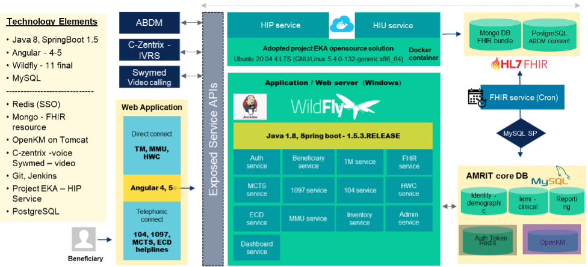
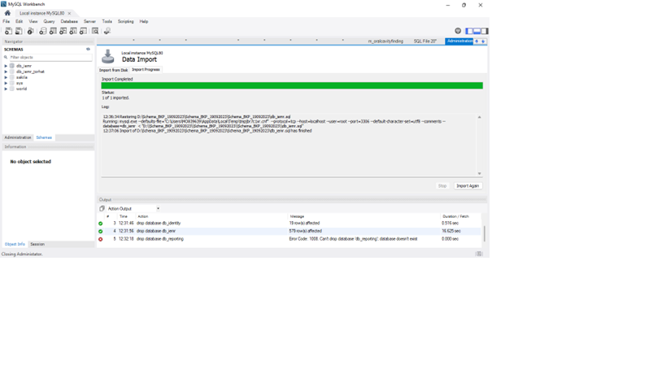
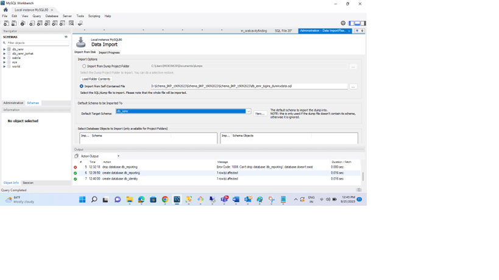
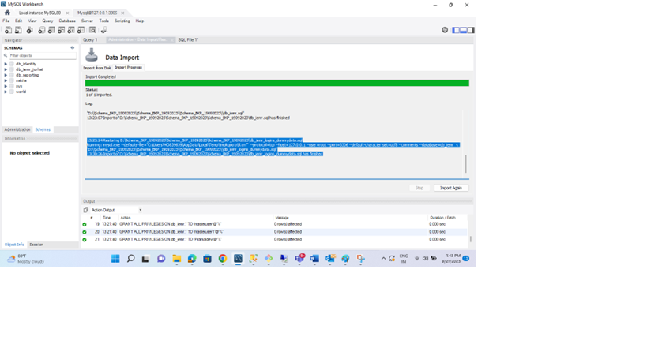
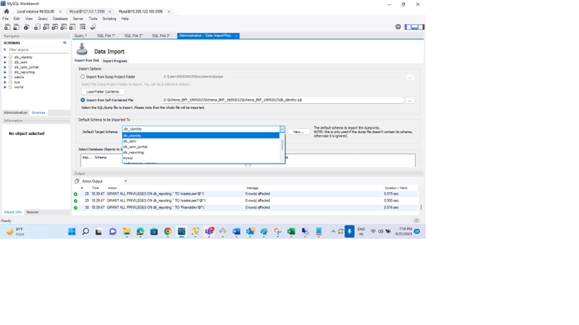
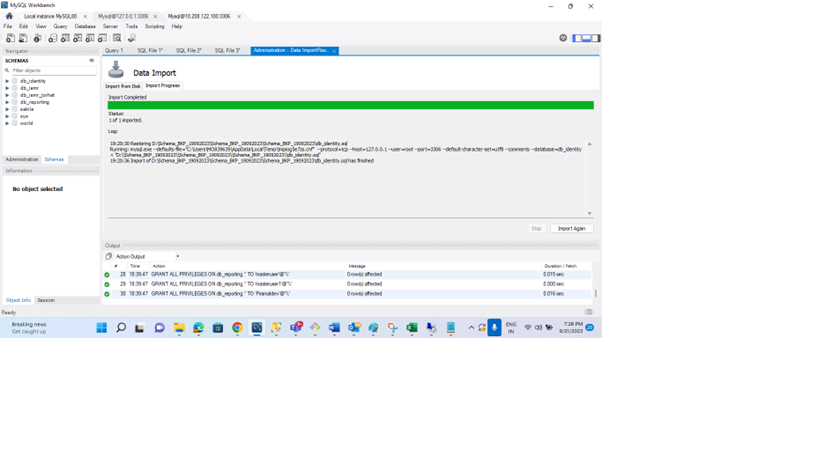

## Overview
AMRIT is primarily built around the Java Spring Boot framework and as outlined in earlier sections provides multiple services oriented around the community health records ecosystem. AMRIT is deployed in multiple states on non-profit model.
Patients, HWCs and PHCs are the key stakeholders. AMRIT can be accessible from various channels like web portal, API access, Mobile app and Tele- medicine.

#### Technology Elements

* Java 8, SpringBoot 1.5.3
* Angular 4 and 5
* Wildfly 11 Final
* MySQL 5.7
* Redis (SSO)
* MongoDB - FHIR Resource
* OpenKM on Tomcat
* Git
* Project EKA - HIP Service
* PostgreSQL

## Technical Architecture 

## Build and run maven code

### Creating a build configuration in STS / Eclipse

* In your editor, click on Run -> Run configuration.
* Double click on Maven build and give a suitable name for the new configuration.
* Populate the base directory by clicking on workspace and selecting HWC-API module.
* Set goals to clean install -DENV_VAR=example(your choice of desired environment) and click on Apply. 
* It is advisable have a personal environment properties file under src/main/environment filling out all the placeholders to avoid repetitive manual work each time you run locally.
* Click Run to run the build configuration.

### Creating a run configuration in STS / Eclipse

* In your editor, click on Run -> Run configuration.
* Double click on Spring Boot App(in STS) / Java Application(in Eclipse) and give a suitable name for the new configuration.
* Select the project and main class and click on Apply.
* Click Run to run the configuration. Keep the Redis server open during this run.
* Once the run is complete, load http://localhost:8080/swagger-ui.html#!/

### How to Import, Build, and Run Maven Code in Visual Studio Code

1. **Install Visual Studio Code**: Download and install [Visual Studio Code](https://code.visualstudio.com/) from the official website.

2. **Install Java**: Ensure you have the Java Development Kit (JDK 1.8) installed on your computer. You can download it from the [Oracle website](https://www.oracle.com/java/technologies/javase-downloads.html) or use an open-source JDK like [OpenJDK](https://adoptopenjdk.net/).

3. **Install Maven**: Make sure you have Apache Maven installed on your system. Download it from the [Apache Maven website](https://maven.apache.org/download.cgi).

4. **Install Visual Studio Code Extensions**:
   - **Java Extension Pack**: Open Visual Studio Code, go to the Extensions view by clicking on the Extensions icon in the Activity Bar, and search for "Java Extension Pack." Install it to get Java support and Maven integration.

5. **Open the Project in Visual Studio Code**:
   - Launch Visual Studio Code.
   - Use the **File > Open Folder** option to open your Maven project folder.

6. **Configure Java and Maven**:
   - If not already configured, set up your Java Home and Maven Home in Visual Studio Code.
   - Go to **File > Preferences > Settings**, search for "Java Home" and "Maven Home," and specify the paths to your JDK and Maven installations.

7. **Build and Run**:
   - To build and run your Maven project, open the integrated terminal in Visual Studio Code (**Terminal > New Terminal**).
   - Navigate to your project directory using the `cd` command.
   - Use Maven commands like `mvn clean install` to build your project.
   - To run your Java application, use mvn spring-boot:run. Ensure the redis server is open during run.

## AMRIT DB restoration

Please find below the zip file of AMRIT blank db with dummy data and global masters.

[blank_db_zip](./Schema_BKP_19092023.zip)

### MYSQL Installation
MySQL is a relational database management system based on SQL – Structured Query Language. The application is used for a wide range of purposes, including data warehousing, e-commerce, and logging applications. The most common use for MySQL, however is for the purpose of a web database.

### Download MySQL from the below link: 

https://dev.mysql.com/downloads/installer/

### Link for installation steps: 

https://software.grok.lsu.edu/Article.aspx?articleid=18737

### DB Restoration Sample steps(link):

### DB Restoration using Workbench:

https://www.greengeeks.com/tutorials/restore-a-mysql-database-from-a-backup-with-mysql-workbench/

### DB Restoration using Commands:

https://blog.devart.com/how-to-restore-mysql-database-from-backup.html

### Required Amrit Schema and Database User Creation:

Create database db_identity;
Create database db_iemr;
Create database db_reporting;  

At the time of MYSQL Installation ,please notedown “root” user password for reference as it will have full privilege.  

### Run below commands to add users & assign permissions before importing database files

CREATE USER 'testuser'@'%' IDENTIFIED BY 'Test@123';  
GRANT ALL PRIVILEGES ON db_iemr.* TO 'testuser'@'%';  
GRANT ALL PRIVILEGES ON db_identity.* TO 'testuser'@'%';
GRANT ALL PRIVILEGES ON db_reporting.* TO 'testuser'@'%';   

The user and password can be changed in each API for running the Spring application.  

### Importing db_iemr schema from workbench

### Importing global master data & dummy login info

### Importing db_identity schema

### Importing db_reporting schema

