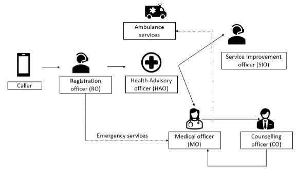
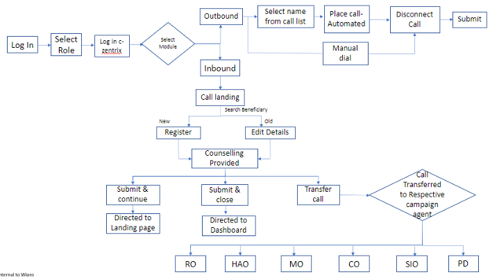

## Overview

104 provides services to ensure that people get basic information on health ailments/ conditions, common remedies for it and the available medical facilities. Any citizen having a health or medical complaint, those desirous of getting advice on medical matters, those who have any complaint to make against any government health facility can dial the toll-free number 104 and get these matters addressed/redressed. 

Qualified and trained paramedics, counsellors, and doctors utilize PSMRI’s software to triage callers. Medically validated algorithms and disease summaries provide paramedics and doctors with the support to drive this high level of standardized care forward.

## Workflow 
•	The beneficiary will reach the contact centre by dialling 104 a toll-free number.  
•	The registration officer (RO) greets the beneficiary and generates a unique registration ID.  
•	The RO transfers the caller to the requested service based on the caller requirement. 
1.	The general health queries are passed on to Health advising officer (HAO)  
2.	The emergency queries are routed to a medical officer (MO), who is a qualified doctor. 
3.	Grievance related queries are passed on to service improvement officer (SIO) and  
4.	The counselling requirements are addressed by a counselling officer (CO). 

## Call Flow

