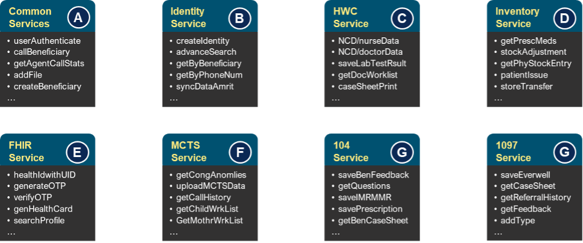

##  Overview
A.M.R.I.T (Accessible Medical Records vis Integrated technology) is a digital health platform developed by PSMRI and Wipro. It connects beneficiaries, health facilities & the health workforce in an integrated ecosystem through technology. AMRIT is leveraged by multiple HWCs across states with services such as 104, 1097, Telemedicine.

## Service Overview
AMRIT services are exposed via well-defined REST API’s as well as UI interfaces for specific line of health applications. Depicted above are the key AMRIT modules & API’s corresponding to relevant modules. Note that nomenclature of actual API signature has been simplified for understanding sake. Actual AMRIT consists of approx. 730+ APIs.

AMRIT comprises of below listed functional services.

- HWC : Health and Wellness Centre is one of the comprehensive applications of AMRIT designed to provide medical
advice & services to beneficiaries.
- Helpline-MCTS :Mother & Child Tracking System provides advice & counselling to would-be and new mothers and her child.
- MMU : Mobile Medical Units are specially equipped vans that provide medical advice & diagnostics in rural areas.
- Helpline-104 : 104 is a helpline providing services such as medical advice, counselling, grievance, directory service and
epidemic outbreak.
- Helpline-1097 : 1097 is National AIDS helpline service providing counselling and care to beneficiary or family suffering with AIDS.
- FHIR : The Fast Healthcare Interoperability Resources' standard is a set of rules and specifications for exchanging electronic health care data.

## Functional Architecture

