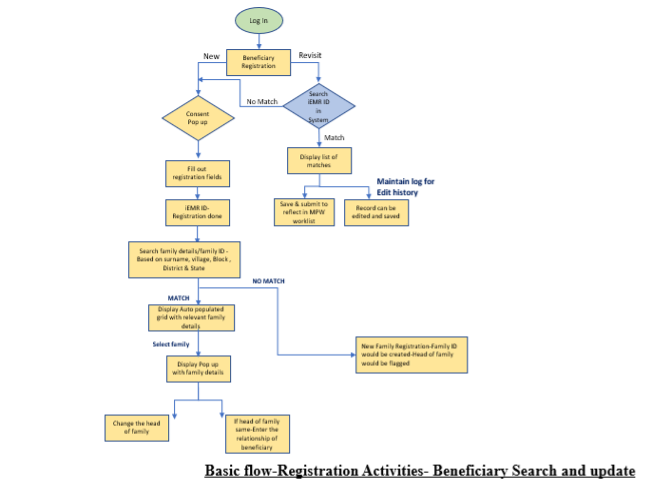
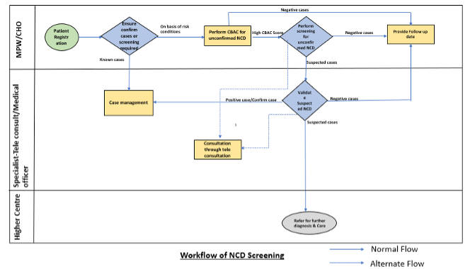
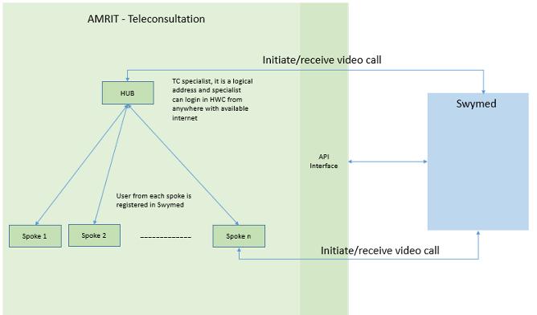
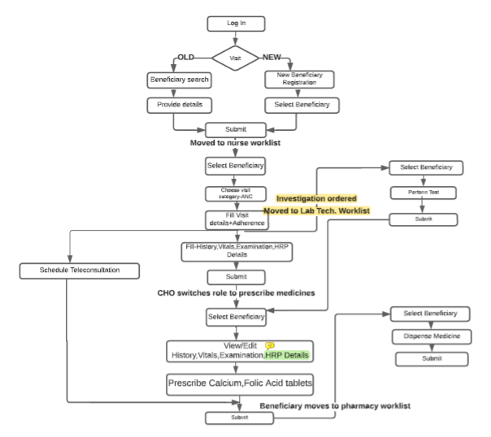
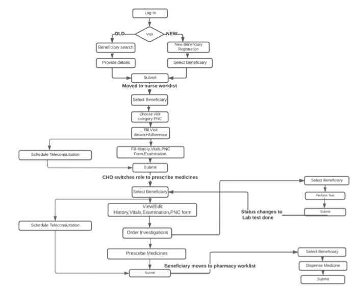
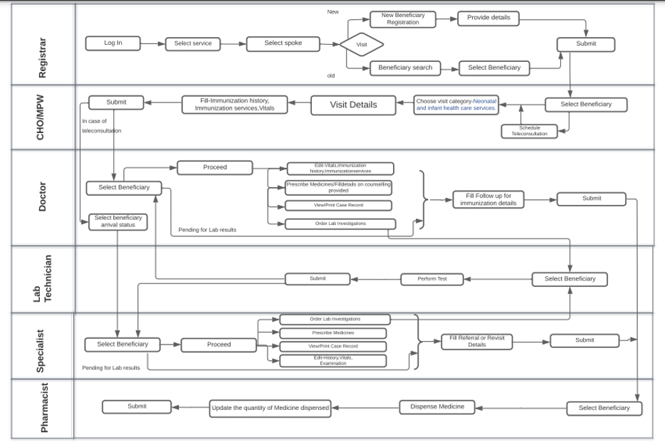
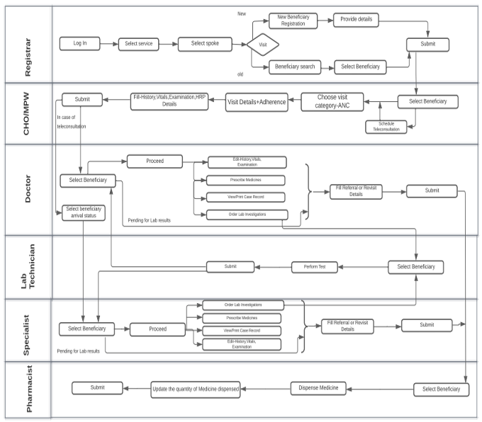

## Overview 

Health and Wellness centre (HWC) is one of the comprehensive applications of AMRIT designed to capture details of 7 Service packages as per guidelines which should be available at Health and Wellness centre.

## Use Cases Overview
: Some of the major use-cases of HWC are as follows.

## Registration  
•	Consent is taken from the beneficiary to register the patient for HWC platform, and a unique health Id is created for each beneficiary after capturing demographic and other relevant details. 
•	For already existing beneficiaries the information can be edited at any point of time.
•	The platform also provides the functionality to create new ABHA ID and download existing ABHA ID card. This is achieved using details issued by government provided Identity cards.
•	Family tagging can also be performed for a family where every tagged family will have a Head of family and members can be added/deleted to the family and each family has a unique identifier -Family ID.

## NCD Module
•	It is one of the service packages of HWC and it covers screening, Referral and follow up care of 
I.	Diabetes Mellitus (DM)
II.	Hypertension (HTN)
III.	Three common cancers -Oral, Breast, and cervical cancer for beneficiaries 
•	Objective is to conduct screening for all the beneficiaries which are having the risk to develop NCD, Age considered for screening NCD is 30 and above 30 years of age. So that, the cases can be identified, and treatment can start early for the identified cases.
•	NCD Module comprises of NCD screening and NCD care, Where Screening is conducted for beneficiaries of Age 30 & above30 and NCD care is provided for Known cases of NCD.
•	Screening of NCD is done using government guidelines- IDRS/ CBAC and observations made by Nurse and validation done by the medical officer.
•	After screening, required steps are taken by the medical officer he might order some investigations or refer the case to higher centre for confirmation of the disease.
•	For known cases of NCD the doctor prescribes medicine and counselling is provided to manage the disease.

Workflow of NCD module:
If beneficiary is not found suspected in any of the screening, visit will be closed.
If beneficiary is found suspected for any of the screening, will be referred to doctor for further consultation.
Doctor consultation can be done at facility directly or through teleconsultation.
Teleconsultation is done through Swymed third party software. Refer below flow diagram for details.

Based on diagnosis Doctor will further investigate and prescribe medicine.
Modules is also having referral system to refer the patient at higher health facility.
For patient flow from 1 role to another, it is using flag for roles in i_ben_flow_outreach table.
Loggers are getting generated in common Wildfly log file.

## ANC Module
•	This service package provides early care for expectant mothers.
•	Previous medical history, Family history, Comorbidities are captured and maintained for the individual which is utilized in subsequent ANC visits of the lady.
•	Obstetric history is also captured and maintained for all the ANC visits.
•	Identification and management of High-risk cases based on parameters like- Young primi, Low hemoglobin, Low lying placenta.  
•	Investigations for hemoglobin and blood glucose is carried out throughout the term.
•	Medications are prescribed based on the trimester -Folic acid, calcium, Iron.

## PNC Module
•	This module helps to provide post-natal care to new mothers.
•	Module captures Delivery details -placed of delivery, complications during delivery, birth weight of Newborn.
•	History, Concurrent conditions, Systemic examination can be performed by the Nurse. 
•	The details can be verified and edited by the doctor.
•	The doctor provides medications, counselling and orders investigations if required.

## Neonatal and infant health care services
•	This module helps to keep record of infant birth details & immunization of Neonates & Infants.
•	Maintains history of immunization and helps in maintaining the details of immunization services.
•	Vitamin A supplementation 
•	Identification, Management, and treatment of any clinical complaints.

## Childhood and adolescent health care services including immunization.
•	This module helps to keep record of Child till the adolescence (1-19 years) birth details & immunization.
•	Maintains history of immunization and helps in maintaining the details of immunization services.
•	Vitamin A supplementation 
•	Identification, Management, and treatment of any clinical complaints.
•	Counselling on -Hygiene, Menstrual hygiene, promote healthy lifestyle.

## Family planning, Contraceptive services and Other Reproductive Health Care. 
•	  This module is used for Family planning, Contraceptive services, and reproductive health.
•	It captures reproductive details of male and females like number of total children, currently using family planning methods. 
•	Counselling is provided on contraception methods, family planning.
•	The dispensation details of contraceptive details are also captured.
•	For follow up cases the side effects of used contraception are treated, and individual is counselled for the same.
•	Referral to higher center is also done for cases like expulsion of Intra uterine contraceptive device (IUCD), Complications of IUCD, Abortion services.

## Care for acute simple illnesses and minor ailments Management of Communicable diseases: National Health Programs. — (General OPD) 
•	This Module helps in providing outpatient services.
•	Identification and management of common ailments (fever, Diarrhea, skin infections)
•	 Referral to higher Centre can be done in case of serious conditions.
•	Basic investigations can be ordered by the doctor and can be performed by lab technician.
•	Drugs are also dispensed based on the prescription of doctor.

